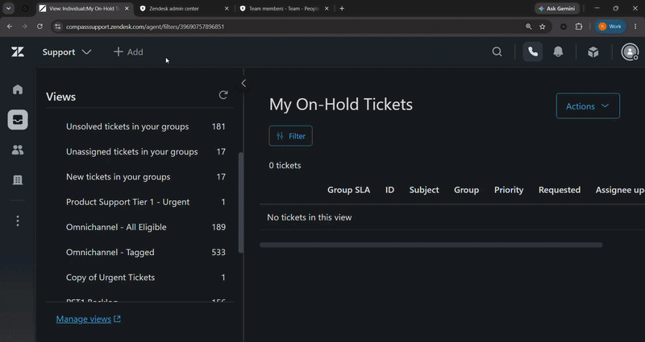

# Zendesk Team Members Export Tool

Export **all Zendesk team members (Agents + Admins)** directly from your browser into a clean CSV file — no API tokens, no apps, no backend setup.

This tool is designed for:
- Support Operations
- Audits & compliance
- Access reviews
- Reporting & analytics
- Internal documentation

It runs **entirely in the browser** using your existing Zendesk session.

---

## ✅ What This Repository Provides

You get **two usage options**, depending on your environment and restrictions.

### Option 1 — All-in-One Export (Recommended)
- Fetches **all agents and admins**
- Automatically downloads a CSV file

Best if:
- File downloads are allowed
- Excel or Sheets is available

### Option 2 — Console-Only + Separate Export
Designed for restricted environments.

- Step 1: Fetch all team members and store data in the browser console
- Step 2: Export that console data to CSV later

Best if:
- File downloads are blocked
- Excel is unavailable
- You need to inspect or modify data before exporting

---

## 🚀 How to Use

### Prerequisites
- Active Zendesk Admin or Agent session
- Access to your Zendesk subdomain
- Modern browser (Chrome, Edge, Firefox)

---

## OPTION 1 — One-Click CSV Export

### Steps
1. Log in to Zendesk
2. Open **Admin Center** or any Zendesk page
3. Open **Developer Tools → Console**
4. Paste the script from:

option-1/export-and-download-csv.js

5. Press **Enter**

### Result
- CSV downloads automatically
- Filename includes total user count
- All numeric IDs are preserved (no scientific notation)

---

## OPTION 2 — Console First, Export Later

### Step 1 — Fetch Team Members
1. Open Zendesk
2. Open **Console**
3. Paste:

option-2/fetch-team-to-console.js

4. Press **Enter**

### Result
- Data stored in memory
- Visible and inspectable in console
- No file download triggered

---

### Step 2 — Export to CSV
When ready:

1. Paste:

option-2/export-console-data-to-csv.js

2. Press **Enter**

### Result
- CSV file downloads
- Uses previously fetched data

---

## 📊 Data Fields Included

Each CSV row includes:

- User ID (Excel-safe)
- Name
- Email
- Role
- Custom Role ID
- Default Group ID
- Active / Suspended / Verified
- 2FA Enabled
- Restricted Agent
- Billing Admin
- Organization ID
- External ID
- Phone
- Locale
- Time Zone
- Last Login
- Created / Updated timestamps
- Photo URL
- Tags

---

## 🧠 Technical Notes

- Uses Zendesk v2 API endpoints
- Handles pagination automatically
- Deduplicates users across roles
- Prevents Excel scientific notation (`="123456789"`)
- Runs fully client-side
- No data is stored or transmitted externally

---

## 🔐 Security & Privacy

- Uses your existing authenticated session
- No credentials are requested or stored
- No third-party services involved
- Data remains local to your browser

---

## ⚠️ Disclaimer

This tool is intended for **internal operational use** only.  
Ensure usage complies with your organization’s security and data policies.

---

## 🤝 Contributions

Enhancements welcome:
- Group & organization expansion
- Role entitlement mapping
- JSON export
- Bookmarklet version

Fork the repo and submit a PR.

---

## 📄 License

MIT License — use freely, modify responsibly.
